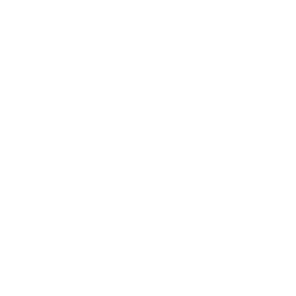

<div align="center">



<h1>VLabs — IIIT Sonepat</h1>

<p><strong>Interactive 3D virtual ECE laboratories. No hardware. No installs. Just a browser.</strong></p>

<p>
  <a href="https://vlabs-iiit-sonepat.vercel.app"></a>
  <a href="https://github.com/OSS-Initiatives-IIIT-Sonepat/vlabs-iiit-sonepat/blob/master/CONTRIBUTING.md"></a>
  <a href="https://discord.gg/5MaJbxFnm"></a>
  
  
</p>

<p>
  
  
  
  
  
  
</p>

</div>

---

## What is VLabs?

VLabs is a browser-based platform that recreates real electronics lab sessions as interactive 3D experiences. Students can place components on a virtual breadboard, wire them step by step, read theory, run simulations, and follow the full **aim → theory → apparatus → procedure → observations → conclusion** flow — all without touching any hardware.

Every 3D component — breadboard, resistor, LED, IC, capacitor, wire — is built from **raw Three.js geometry**. No GLTF models. No black-box 3D engines. Every pin, copper strip, and colour band is procedurally generated code you can read and understand.

The platform currently covers **70+ lab experiments** across four semesters of the ECE undergraduate curriculum at IIIT Sonepat, including:

- Analog electronics (rectifiers, diodes, Thevenin, Norton, Kirchhoff)
- Digital electronics (logic gates, adders, multiplexers, flip-flops, counters)
- Combinational arithmetic (CLA adder, Booth's multiplier, Wallace tree)
- Memory & CPU systems (ALU simulation, cache models, CPU design)
- 8085 assembly programming (emulator with register view, step-by-step execution)
- Peripheral interfacing (ADC/DAC, GPIO, 7-segment display)
- C programming fundamentals (expressions, file I/O)

---

## Why open source?

The students who need good virtual labs most are at institutions that can't pay for proprietary tools. A solution behind a license wall reproduces the exact access inequality it's trying to fix — just one layer up.

VLabs is **non-profit**, **libre** (free to use, modify, and redistribute through **December 2026**), and built entirely in the open. If you find a missing experiment or a wrong procedure step, you can fix it. The architecture is explicitly designed so that a UG student, assisted by an AI coding assistant, can add a complete lab without ever touching the 3D renderer.

---

## Architecture — how to contribute an experiment

Every experiment is a set of plain TypeScript data files. The 3D scene, step navigation, and floating info cards are handled automatically.

```
src/labs/semesters/
  semester-01/
    01-analog-electronics/
      half-wave-rectifier/
        01-aim.ts              ← what the experiment teaches
        02-theory.ts           ← background concepts
        03-apparatus.ts        ← components list
        04-procedure/
          01-breadboard.ts     ← place the board
          02-place-ac-source.ts
          ...
          index.ts
        05-observations.ts     ← expected results & tables
        06-conclusion.ts       ← summary
        components.ts          ← circuit layout (what goes where on the board)
        index.ts               ← assembles into ExperimentDefinition
```

`components.ts` describes which component goes at which column and row, and how pins connect. The procedure folder is one file per step. No JSX. No rendering logic. Just structured TypeScript objects.

The context files — [`COMPONENTS.md`](src/labs/COMPONENTS.md) and [`APPARATUS.md`](src/labs/APPARATUS.md) — contain the full pin reference, column layout rules, and component type registry. Paste them into any AI coding assistant and say "generate a half-wave rectifier experiment" — it knows the full schema.

See the [quickstart guide](https://vlabs-iiit-sonepat.vercel.app/docs/quickstart) for a step-by-step walkthrough.

---

## Tech stack

| Layer | Technology |
|---|---|
| Framework | Next.js 16 (App Router, RSC) |
| Language | TypeScript 5 |
| 3D rendering | **Raw Three.js** — procedural geometry, no models |
| Styling | Tailwind CSS v4 (CSS-first config) |
| UI primitives | Custom design system (migrated from Twenty CRM's Linaria base) |
| Search | Build-time full-text index (1486+ entries) |
| Fonts | Host Grotesk · Aleo · Azeret Mono · Inria Serif |
| Deployment | Vercel |
| Package manager | npm |

---

## Development

```bash
# Install dependencies
npm install

# Start dev server (also builds search index)
npm run dev
# → http://localhost:3003

# Production build
npm run build

# Run tests
npm test

# Lint
npx eslint .

# Format
npx prettier --write .

# Rebuild search index manually
npm run search:index

# Regenerate favicon from SVG
node scripts/generate-favicon.mjs
```

---

## Development history & ownership

VLabs was initiated by **Shubham Singh** — President of the Technical Society of IIIT Sonepat (2026–27 academic year). The majority of the codebase — the 3D component renderer, circuit engine, lab content pipeline, simulation framework, and design system migration — was written by Shubham between **June and September 2026**, taking the project from an empty repository to a fully functional platform ready for community contributions.

**GitHub:** [@FirePheonix](https://github.com/FirePheonix)

The **current President of the Technical Society of IIIT Sonepat** owns all rights to this repository. Organisational decisions, roadmap direction, and release authority rest with the sitting president.

### Design system & Twenty CRM

The initial UI component architecture and layout patterns were adapted from the **`twenty-ui` package** of [Twenty CRM](https://twenty.com/) ([GitHub](https://github.com/twentyhq/twenty)).

> **License note:** `twenty-ui` is explicitly licensed under the **MIT License** (as declared in its `package.json` and package-level `LICENSE` file), separate from the AGPLv3 that governs Twenty's core application. VLabs derives exclusively from this MIT-licensed package — not from any AGPLv3 or commercially-licensed portions of the Twenty repository.

MIT requires preserving the copyright notice. In compliance:

```
Copyright (c) 2023-present Twenty.com, PBC
```

The original styling was in Linaria (CSS-in-JS). All styles were fully migrated to **Tailwind CSS v4** and every design rebuilt to match our own application identity in the [Figma workspace](https://www.figma.com/design/8OKl25CDzj9DO9b0VCjEVq/Open-Source-Initiatives?node-id=0-1&t=3cuqh6GhRT47vFps-1). By the end of the migration, the only thing remaining from the original code was the component architecture inspiration — all styling, tokens, and visual identity are our own.

Full license text: [github.com/twentyhq/twenty — License](https://github.com/twentyhq/twenty?tab=License-1-ov-file)

---

## Contributing

All are welcome to contribute — students, educators, engineers, designers.

- Read [`CONTRIBUTING.md`](CONTRIBUTING.md) to get started
- Read [`src/labs/COMPONENTS.md`](src/labs/COMPONENTS.md) for the component & pin reference
- Read [`src/labs/APPARATUS.md`](src/labs/APPARATUS.md) for the apparatus schema
- Open an issue if an experiment is missing or a procedure step is wrong
- Join the [Discord](https://discord.gg/5MaJbxFnm) to ask questions

You don't need to know Three.js to contribute. If you understand the experiment, an AI agent can help you write the data files.

---

## License

VLabs' own source code is **libre** — free to use, modify, and distribute through **December 2026**.

After that, the project's terms will be decided by the sitting president of the Technical Society of IIIT Sonepat. The intention is to keep it open.

**Third-party attribution:**

Portions of the UI component architecture are derived from [`twenty-ui`](https://github.com/twentyhq/twenty) by Twenty.com, PBC, licensed under the MIT License. Copyright © 2023-present Twenty.com, PBC. The full MIT license text is available at the [Twenty repository](https://github.com/twentyhq/twenty?tab=License-1-ov-file).

---

<div align="center">

Built with care at **IIIT Sonepat** · [vlabs-iiit-sonepat.vercel.app](https://vlabs-iiit-sonepat.vercel.app) · [Discord](https://discord.gg/5MaJbxFnm) · [GitHub](https://github.com/OSS-Initiatives-IIIT-Sonepat/vlabs-iiit-sonepat)

</div>
